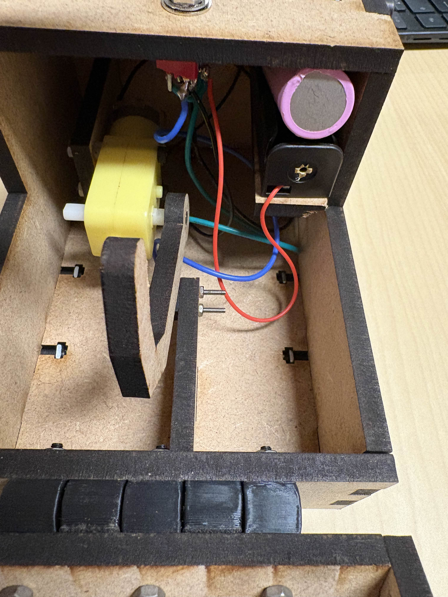

# Séance 4 : 26 Janvier 2026 - Découpe Laser

## Objectifs de la séance
* Comprendre le fonctionnement et les dangers d'une découpeuse laser CO2.
* Connaître les paramètres de coupe. 

## Résumé du cours

### 1. Principe et Machine
Nous utilisons une **Laser CO2** au FabLab.
* **Fonctionnement :** Un tube génère un faisceau laser (infrarouge) qui est dirigé par un jeu de miroirs jusqu'à la tête de découpe, où une lentille le focalise en un point très chaud.
* **Matériaux compatibles :** Principalement les matériaux organiques comme le bois (MDF, Contreplaqué), le carton, le cuir et les plastiques comme l'Acrylique (PMMA).
* **Sécurité & Environnement :**
    * C'est une machine de **Classe 4** (Risque d'incendie et de brûlure).
    * **Interdiction stricte :** Ne jamais couper de PVC ou Vinyle (dégage du chlore gazeux mortel pour l'homme et la machine).
    * **Ventilation :** Il y a de fortes odeurs après la découpe (bois brûlé/plastique fondu), il faut attendre avant d'ouvrir le capot.

### 2. Les 3 Paramètres Cruciaux
Pour réussir une découpe ou une gravure, il faut régler trois variables dans le logiciel :
1.  **Puissance (Power) :** L'intensité du rayon (en %). Trop fort = brûlures ; Trop faible = ne traverse pas.
2.  **Vitesse (Speed) :** La rapidité de déplacement de la tête.
    * *Coupe (Vecteur) :* Vitesse lente / Puissance élevée.
    * *Gravure (Raster) :* Vitesse rapide / Puissance modérée.
3.  **Fréquence (PPI/Hz) :** Le nombre d'impulsions par seconde. Une fréquence élevée donne un bord plus net (poli) sur l'acrylique.

### 3. Astuces de Conception
*  Le laser a une épaisseur (environ 0.1 - 0.2mm). Si on veut faire des gravures mettre une forte épaisseur au lieu d'épaisseur fine pour réaliser des gravures
* **Assemblages malins :**
    * *Notches :* Créneaux pour emboîter des plaques à 90°.
    * *Captive Nut (Écrou prisonnier) :* Découper une forme en "T" dans le bois pour y glisser un écrou métallique et pouvoir visser solidement (vu en cours).
    * *Living Hinge :* Motifs spécifiques permettant de plier du bois rigide.

##  Application au Projet LumaDome
La découpe laser servira à créer le **squelette** de l'abat-jour.

* **Design :** Conception de "couples" (comme sur un bateau) ou d'anneaux concentriques en MDF 3mm.
* **Assemblage :** Je vais utiliser la technique des **encoches (Notches)** pour assembler la structure laser sur la base imprimée en 3D.
* **Fixation Tissu :** Je prévois des petits trous dans la découpe laser pour pouvoir coudre le tissu directement sur le bois plus tard.

### TP Pratique : La "Useless Box"

En parallèle de l'apprentissage machine, j'ai réalisé un projet complet : une **Useless Box** . Ce projet m'a permis de lier la conception 3D et la fabrication réelle.

**1. Conception (Onshape) :**
J'ai modélisé l'intégralité du système avant fabrication pour valider les dimensions :
* **Le Boîtier :** Structure conçue pour être découpée au laser (assemblage par encoches/créneaux).
* **Les Supports Internes :** Conception sur mesure du support pour la pile et du berceau pour le moteur DC.
* **Le Mécanisme :** Modélisation du bras  qui vient physiquement basculer l'interrupteur pour inverser le sens de reotation du moteur et couper le circuit lors de la pose sur le levier à moustache.

**2. Composants utilisés :**
* Moteur DC + Support imprimé/découpé.
* Pile (Alimentation) + Logement.
* Interrupteur à levier (Toggle Switch).

**3. Assemblage & Résultat :**
Après la découpe et l'impression des supports, j'ai assemblé le tout. Le réglage de la course du levier (la moustache) a été l'étape clé pour qu'il touche parfaitement l'interrupteur.

**Galerie du projet :**

*Vue d'ensemble de la boîte fermée :*

*Vue interne (Mécanisme et Supports) :*

**Démonstration :**
[Vidéo du fonctionnement en action](../06_Documentation/Video/Exo_Useless_Box_video/Useless_Box_video.mov)

##  Tâches effectuées
- [x] Formation sécurité sur la découpeuse laser CO2.
- [x] Test des paramètres (Vitesse/Puissance) sur une chute de MDF.
- [x] TP mise en pratique "Useless Box" (Vitesse/Puissance).
