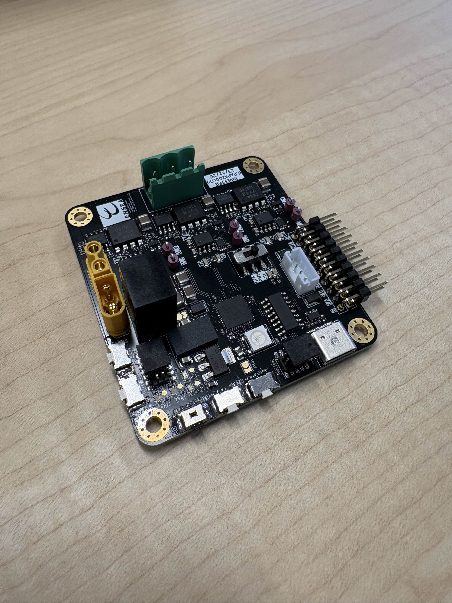

# Séance 5 : 29 Janvier 2026 - Soudure & Assemblage PCB

## Objectifs de la séance
* Comprendre la théorie du brasage (Soudure) : mouillage, flux, alliages.
* Apprendre le processus industriel CMS (Composants Montés en Surface).
* Pratiquer l'assemblage manuel (Fer à souder) et la refusion (Four).

## Résumé du cours
### 1. Théorie de la soudure
Le brasage est un procédé d'assemblage permanent établissant une liaison métallique.
* **Le Flux :** Indispensable, il sert à décaper les surfaces (enlever l'oxyde), favoriser le mouillage et protéger le métal lors de la chauffe.
* **Sécurité :** Les fumées de soudure sont nocives (colophane). Il faut impérativement travailler dans une zone ventilée et se laver les mains après manipulation (risque plomb).

### 2. Procédé CMS (Surface) vs Traversant
* **Soudure Manuelle (Traversant) :** On utilise un fer chauffé entre **350°C et 400°C**. La technique consiste à chauffer simultanément la pastille et la patte du composant avant d'apporter l'étain.
* **Procédé Reflow (CMS) :** Utilisé pour les composants de surface.
    * **Pâte à braser :** Mélange de billes d'étain et de flux. Elle a une durée de vie limitée une fois sortie du frigo.
    * **Stencil (Pochoir) :** Feuille d'inox découpée au laser permettant de déposer la pâte précisément sur les empreintes du PCB.
    * **Four à refusion :** Suit un profil thermique précis : Préchauffage (montée en température), Soak (activation du flux), Reflow (fusion de l'alliage) et Refroidissement.

## Travaux Pratiques : Assemblage PCB
*Travail réalisé en trinôme avec Elise FIRMIN et Emilie ZHENG.*

### Étape 1 : Composants CMS (Surface)
1.  **Dépôt de pâte :** Réalisé par les encadrants à l'aide du stencil.
2.  **Placement (Pick & Place) :**
    * Pendant que mes camarades récupéraient et triaient les composants nécessaires dans le FabLab, j'ai assuré le placement des composants sur le PCB.
    * =Utilisation de brucelles pour déposer les composants sur la pâte à braser sans l'étaler=.
3.  **Cuisson :** Passage de la carte dans le four à refusion pour braser tous les composants d'un coup.

### Étape 2 : Composants Traversants & Finitions
Après la sortie du four, nous avons terminé la carte manuellement :
* **Soudure au fer :** Fixation des connecteurs traversants (headers).
* **Cas particulier des Boutons Poussoirs :** Nous les avons soudés à la main **après** le passage au four.
    * *Raison technique :* Lors d'essais précédents, le plastique des boutons fondait à cause de la chaleur du four, rendant le mécanisme inopérant.

## Notes importantes pour le Projet LumaDome

### Électronique (BOM)
Pour la commande des composants de mon projet personnel :
* Il faut impérativement renseigner la **référence fabricant (MPN - Manufacturer Part Number)** pour tous les composants (CI, Connecteurs, Leds).
* *Exception :* Pour les **résistances**, la valeur simple suffit (ex: 10kΩ, 220Ω).

### Mécanique (Vis)
Mise à jour des contraintes pour la modélisation 3D (Base) :
* Le stock disponible contient 1000 vis de **16mm**.
* **Action CAD :** Je dois adapter mes épaisseurs et rajouter **2mm** de marge aux joints d'assemblage pour être sûr que ces vis serrent correctement sans dépasser ou être trop courtes.

## ✅ Tâches effectuées
- [x] Placement des composants CMS sur pâte à braser.
- [x] Soudure manuelle des traversants.
- [x] Validation visuelle des joints de soudure (brillants et lisses).
- [ ] Mise à jour du BOM LumaDome avec les MPN.
- [ ] Correction du CAD Base (Tolérance vis 16mm).